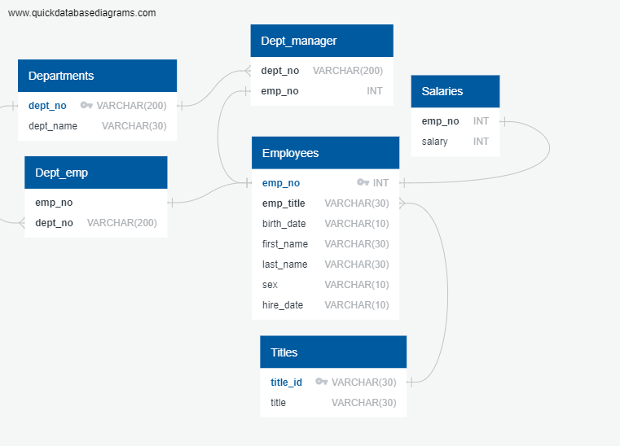
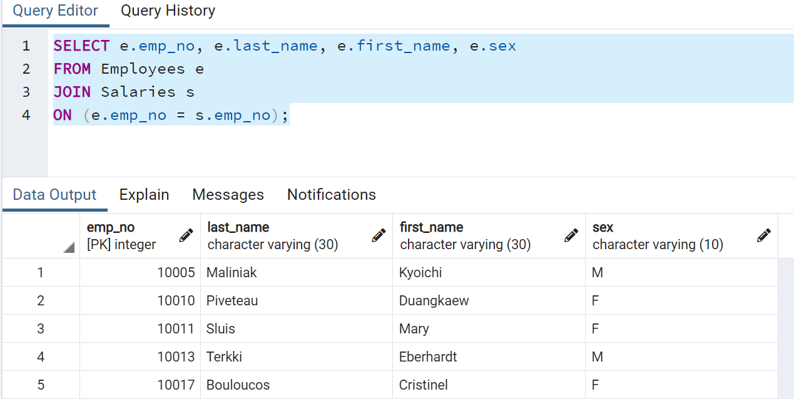
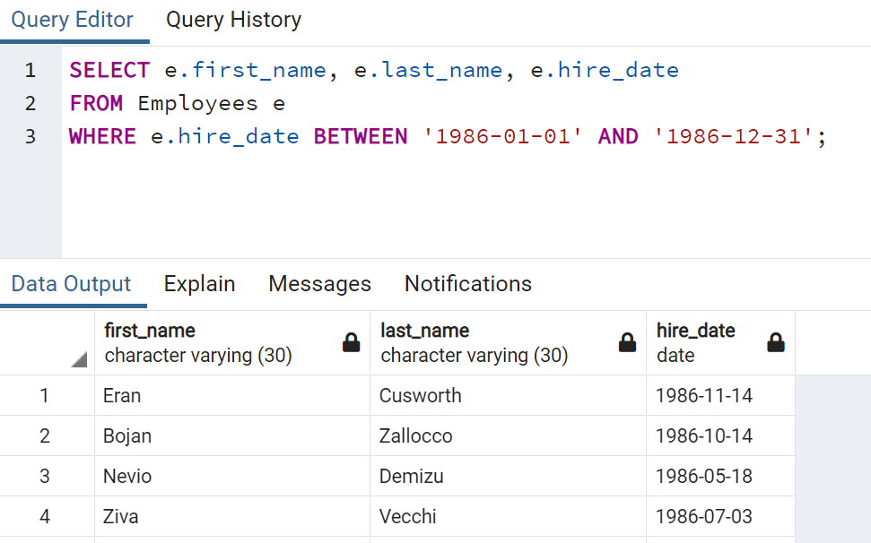
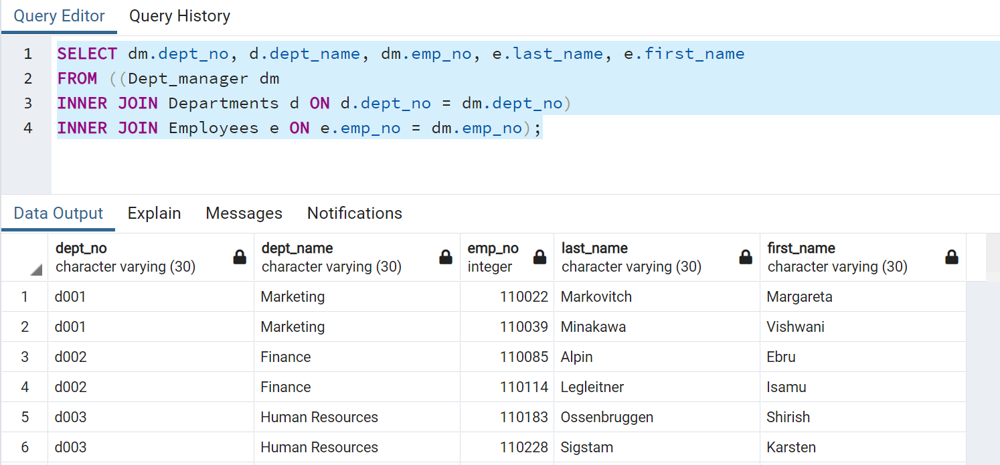
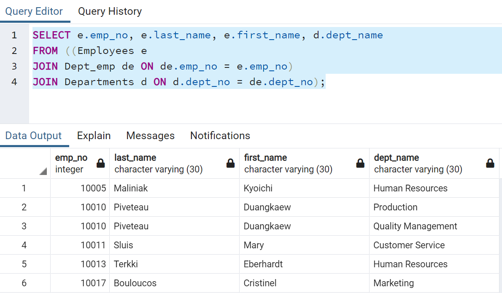
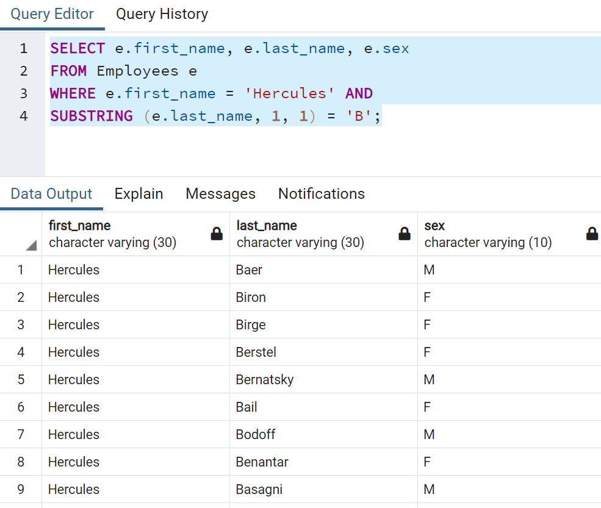
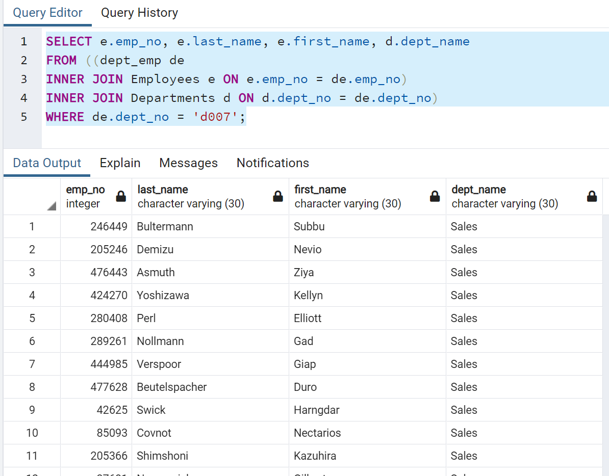
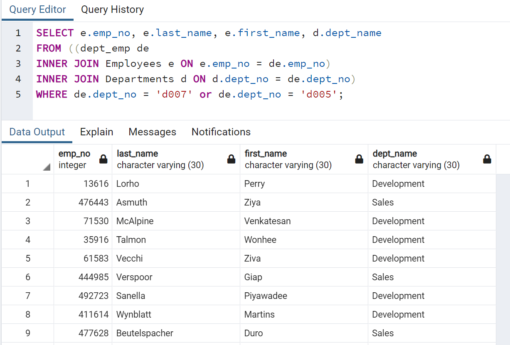
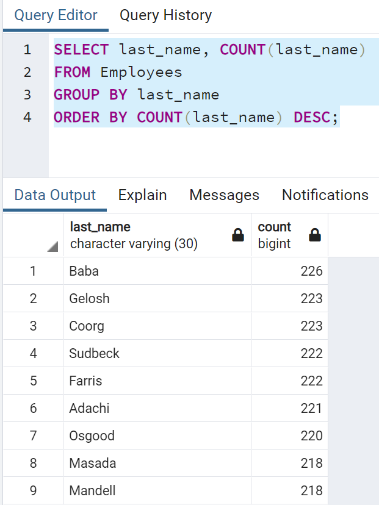

# Employee Exploration SQL

## Employee Database

We were given six tables with different data about employees and their departments. We first assessed our tables for their relational data and constraints. We built out a database diagram on Quickdatabasediagrams.com. Our txt file for that code is in the sql-challenge/EmployeeSQL folder as a .txt file. We saved the diagram as a PNG to the Images folder in the same address.

We wanted to import the data in SQL from our CSVs. We did so by creating tables that corresponded to the CSV data that we were importing. Once each of our tables were built (schema.sql) we could then import the data and start to analyze it.

## Queries (queries.sql) 

  We wanted to pull employee number , last name, first name, sex, and salary. In order to do so, we had to join our Salaries table to our employees table.

 

  We wanted each employee's first name, last name and hire date for all employees hired in 1986. We used the Employees table and set parameters from 1/1/1986 to 12/31/1986.

  We wanted the each of the manager's department number, department name, employee number, last name and first name. Here we had to pull together three tables and INNER JOIN     them all. We used dept_manager first to get the list of managers, their department number and employee number. Then we inner joined Departments table on dept_no to get department names. Finally we inner joined the Employees table on the emp_no to get the manager's first and last names.

  4- We wanted all employee's number, last name, first name, and department name. For this we needed to join the three tables. We started with the Employees table to get their   number, first name, and last name. To get the department name we had to join Dept_emp to Employees on emp_no. Then to get the actual department name, we joined Departments on    dept_no.

  5- To get the first name, last name and sex for employees whose first name was "Hercules" and last name started with a "b" we first retrieved first name, last name, ad sex from the Employee table. We then used a WHERE statement to say that the first name must equal "Hercules and a SUBSTRING statement to retrieve the first character in the last name and make sure it was equal to "B"

  6- We wanted to take a look at the Sales Department. We wanted their employee number, last name, first name nad department name. We queried the Employee data for the first and last name. We inner joined dept_emp with Employee on emp_no We then inner joined Departments on dept_no to get the department name. At the end we used a WHERE statement to make sure that the dept_no equaled 'd007' which was the code for the sales department.

  7- This was similar to the previous analysis. Instead we wanted to grab employees from both the Sales and Development departments. In order to do so we used the same approach as 6 but at the end the WHERE statement became boolean where dept_no could equal d007 (Sales) or d005 (Development).

8- We checked the frequency of last names and ordered them by highest occurence to lowest occurence within the company. We pulled last name and count of last name from Employees table and grouped by last name. We then arranged their order in descending popularity with and ORDER BY command.

